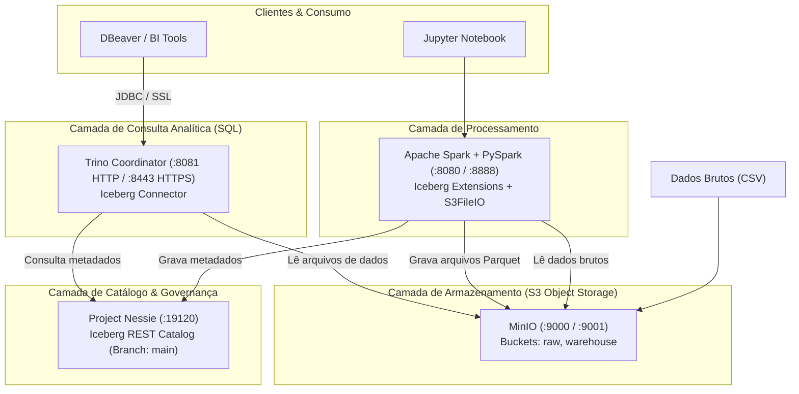

# Roteiro Completo de Instalação, Configuração e Validação do Data Lakehouse

Este documento apresenta o guia completo, consolidado e definitivo para a instalação, configuração e operação do **Data Lakehouse Local**, baseado na arquitetura **Apache Iceberg**, **Project Nessie**, **MinIO**, **Apache Spark** e **Trino**, contemplando suporte a conexões seguras (HTTPS/TLS) e consumo via clientes SQL (como **DBeaver**).

> [!NOTE]
> Este roteiro contém **exclusivamente as etapas, arquivos e parâmetros validados com sucesso**, eliminando tentativas incorretas ou configurações conflitantes.

---

## 1. Arquitetura e Fluxo de Dados

A arquitetura adota o padrão de **Lakehouse** com **Arquitetura Medalhão** (camadas Bronze, Silver e Gold):



### Mapeamento de Portas e Serviços

| Serviço | Porta Host | Porta Container | Protocolo | Descrição |
| :--- | :--- | :--- | :--- | :--- |
| **MinIO API** | `9000` | `9000` | HTTP | API compatível com Amazon S3 |
| **MinIO Console** | `9001` | `9001` | HTTP | Interface Web administrativa de buckets e arquivos |
| **Project Nessie** | `19120` | `19120` | HTTP | API REST do Catálogo Iceberg com controle de versão |
| **Spark Master UI** | `8080` | `8080` | HTTP | Interface de monitoramento do cluster Spark |
| **Jupyter Notebook**| `8888` | `8888` | HTTP | Interface para pipelines PySpark |
| **Trino Web / HTTP**| `8081` | `8080` | HTTP | Endpoint HTTP e console Web do Trino |
| **Trino HTTPS (SSL)**| `8443` | `8443` | HTTPS | Endpoint TLS seguro com Keystore PKCS12 |

---

## 2. Estrutura de Diretórios do Projeto

```text
datalake-lab/
├── docker-compose.yml
├── gerar_dataset.py
├── ROTEIRO_DATALAKE.md
├── data/
│   └── raw/
│       └── vendas_detalhadas.csv
├── notebooks/
│   └── pipeline_vendas.ipynb
├── spark-conf/
│   └── spark-defaults.conf
└── trino/
    ├── config.properties
    ├── keystore.p12
    └── catalog/
        └── iceberg.properties
```

---

## 3. Passo a Passo de Instalação e Configuração

### Passo 1: Criação dos Diretórios Base

```bash
mkdir -p data/raw notebooks spark-conf trino/catalog
```

---

### Passo 2: Geração do Certificado SSL / Keystore para o Trino

Para permitir conexões seguras criptografadas (HTTPS/TLS) no Trino na porta `8443`, gere um Keystore no formato **PKCS12** com alias `trino` e senha `changeit`:

```bash
keytool -genkeypair \
  -alias trino \
  -keyalg RSA \
  -keysize 2048 \
  -validity 365 \
  -keystore trino/keystore.p12 \
  -storetype PKCS12 \
  -storepass changeit \
  -dname "CN=localhost, OU=Data, O=Lab, L=SP, ST=SP, C=BR"
```

---

### Passo 3: Configuração do Apache Spark com Iceberg e Nessie

Crie o arquivo `spark-conf/spark-defaults.conf` para instruir o Spark a utilizar o conector Iceberg, o catálogo Nessie e o backend de I/O compatível com S3 (MinIO):

```properties
# spark-conf/spark-defaults.conf
spark.sql.extensions                    org.apache.iceberg.spark.extensions.IcebergSparkSessionExtensions
spark.sql.catalog.nessie                org.apache.iceberg.spark.SparkCatalog
spark.sql.catalog.nessie.catalog-impl   org.apache.iceberg.nessie.NessieCatalog
spark.sql.catalog.nessie.uri            http://nessie:19120/api/v1
spark.sql.catalog.nessie.ref            main
spark.sql.catalog.nessie.warehouse      s3://warehouse/
spark.sql.catalog.nessie.io-impl        org.apache.iceberg.aws.s3.S3FileIO
spark.sql.catalog.nessie.s3.endpoint    http://minio:9000
spark.sql.catalog.nessie.s3.path-style-access  true
spark.sql.catalog.nessie.s3.access-key-id      admin
spark.sql.catalog.nessie.s3.secret-access-key  password123
spark.sql.catalog.nessie.client.region  us-east-1
spark.sql.defaultCatalog                nessie
```

---

### Passo 4: Configuração do Catálogo Iceberg no Trino

Crie o arquivo `trino/catalog/iceberg.properties` para conectar o Trino ao catálogo Nessie e ao MinIO:

```properties
# trino/catalog/iceberg.properties
connector.name=iceberg
iceberg.catalog.type=nessie
iceberg.nessie-catalog.uri=http://nessie:19120/api/v1
iceberg.nessie-catalog.default-warehouse-dir=s3://warehouse/
iceberg.nessie-catalog.ref=main
fs.s3.enabled=true
s3.endpoint=http://minio:9000
s3.region=us-east-1
s3.path-style-access=true
s3.aws-access-key=admin
s3.aws-secret-key=password123
```

---

### Passo 5: Configuração do Servidor Trino (HTTP e HTTPS)

Crie o arquivo `trino/config.properties`. 

> [!IMPORTANT]
> Não declare `catalog.management=system`. No Trino, o gerenciamento de catálogos via arquivos estáticos montados em `/etc/trino/catalog` é o padrão (`static`).

```properties
# trino/config.properties
coordinator=true
node-scheduler.include-coordinator=true
discovery.uri=http://localhost:8080

# Habilitando HTTPS / TLS
http-server.https.enabled=true
http-server.https.port=8443
http-server.https.keystore.path=/etc/trino/keystore.p12
http-server.https.keystore.key=changeit
```

---

### Passo 6: Orquestração dos Serviços via Docker Compose

Crie o arquivo `docker-compose.yml` que sobe o MinIO, o inicializador de buckets (`mc-init`), o Nessie, o Spark-Iceberg (com Jupyter) e o Trino:

```yaml
# docker-compose.yml
services:
  minio:
    image: minio/minio:latest
    container_name: minio
    environment:
      MINIO_ROOT_USER: admin
      MINIO_ROOT_PASSWORD: password123
    command: server /data --console-address ":9001"
    ports:
      - "9000:9000"   # API S3
      - "9001:9001"   # Console web
    volumes:
      - minio-data:/data
    healthcheck:
      test: ["CMD", "curl", "-f", "http://localhost:9000/minio/health/live"]
      interval: 5s
      retries: 5

  mc-init:
    image: minio/mc:latest
    depends_on:
      minio:
        condition: service_healthy
    entrypoint: >
      /bin/sh -c "
      mc alias set minio http://minio:9000 admin password123 &&
      mc mb --ignore-existing minio/warehouse &&
      mc mb --ignore-existing minio/raw &&
      echo 'buckets prontos'"

  nessie:
    image: projectnessie/nessie:latest
    container_name: nessie
    ports:
      - "19120:19120"

  spark-iceberg:
    image: tabulario/spark-iceberg:latest
    container_name: spark-iceberg
    depends_on:
      - nessie
      - mc-init
    environment:
      AWS_ACCESS_KEY_ID: admin
      AWS_SECRET_ACCESS_KEY: password123
      AWS_REGION: us-east-1
    ports:
      - "8888:8888"   # Jupyter Notebook
      - "8080:8080"   # Spark Master UI
    volumes:
      - ./notebooks:/home/iceberg/notebooks/notebooks
      - ./data:/home/iceberg/data
      - ./spark-conf/spark-defaults.conf:/opt/spark/conf/spark-defaults.conf

  trino:
    image: trinodb/trino:latest
    container_name: trino
    depends_on:
      - nessie
      - mc-init
    ports:
      - "8081:8080"   # HTTP (Porta 8080 do Trino mapeada para 8081 no host)
      - "8443:8443"   # HTTPS (Porta 8443 com SSL)
    volumes:
      - ./trino/catalog:/etc/trino/catalog
      - ./trino/config.properties:/etc/trino/config.properties
      - ./trino/keystore.p12:/etc/trino/keystore.p12

volumes:
  minio-data:
```

---

### Passo 7: Inicialização dos Contêineres

Para iniciar todo o ambiente em segundo plano:

```bash
docker compose up -d
```

---

### Passo 8: Geração do Dataset Sintético (Python Faker)

Instale a biblioteca `faker` no ambiente local:

```bash
pip install faker
```

Execute o script `gerar_dataset.py`:

```python
# gerar_dataset.py
import csv
import random
from faker import Faker

fake = Faker('pt_BR')
Faker.seed(42)

with open('data/raw/vendas_detalhadas.csv', mode='w', newline='', encoding='utf-8') as f:
    writer = csv.writer(f)
    writer.writerow([
        "id_venda", "cliente_nome", "cliente_email", "estado",
        "produto", "categoria", "quantidade", "preco_unitario", "data_venda"
    ])
    
    produtos = [
        ("Notebook Gamer", "Eletrônicos", 4500.00),
        ("Mouse sem Fio", "Acessórios", 120.00),
        ("Teclado Mecânico", "Acessórios", 350.00),
        ("Monitor 27pol", "Eletrônicos", 1300.00),
        ("Cadeira Ergonômica", "Móveis", 950.00)
    ]
    
    for i in range(1, 1001):
        prod, cat, preco = random.choice(produtos)
        qtd = random.randint(1, 5)
        writer.writerow([
            i,
            fake.name(),
            fake.email(),
            fake.state_abbr(),
            prod,
            cat,
            qtd,
            preco,
            fake.date_between(start_date='-1y', end_date='today').isoformat()
        ])

print("Dataset gerado com sucesso em data/raw/vendas_detalhadas.csv!")
```

Execute com:
```bash
python3 gerar_dataset.py
```

---

### Passo 9: Pipeline de Dados Medallion no Apache Spark

No Jupyter (`http://localhost:8888`) ou via PySpark, execute o pipeline de ingestão e transformação:

#### 9.1. Criação dos Namespaces no Catálogo Nessie
```python
spark.sql("CREATE NAMESPACE IF NOT EXISTS nessie.bronze")
spark.sql("CREATE NAMESPACE IF NOT EXISTS nessie.silver")
spark.sql("CREATE NAMESPACE IF NOT EXISTS nessie.gold")
```

#### 9.2. Camada Bronze (Ingestão Raw em Formato Iceberg)
```python
df_bronze = spark.read.option("header", True).csv("/home/iceberg/data/raw/vendas_detalhadas.csv")
df_bronze.writeTo("nessie.bronze.vendas").createOrReplace()
```

#### 9.3. Camada Silver (Tipagem, Higienização, Particionamento)
```python
from pyspark.sql.functions import col, to_date

df_bronze = spark.table("nessie.bronze.vendas")

df_silver = (
    df_bronze
    .withColumn("id_venda", col("id_venda").cast("long"))
    .withColumn("quantidade", col("quantidade").cast("integer"))
    .withColumn("preco_unitario", col("preco_unitario").cast("decimal(10,2)"))
    .withColumn("data_venda", to_date(col("data_venda"), "yyyy-MM-dd"))
    .withColumn("valor_total", col("quantidade") * col("preco_unitario"))
    .dropDuplicates(["id_venda"])
)

df_silver.writeTo("nessie.silver.vendas").partitionedBy(col("estado")).createOrReplace()
```

#### 9.4. Camada Gold (Agregação Analítica para Negócio)
```python
from pyspark.sql.functions import sum as _sum, count as _count, round as _round

df_silver = spark.table("nessie.silver.vendas")

df_gold_categoria = (
    df_silver
    .groupBy("estado", "categoria")
    .agg(
        _count("id_venda").alias("total_pedidos"),
        _round(_sum("valor_total"), 2).alias("receita_total")
    )
    .orderBy("estado", "receita_total", ascending=False)
)

df_gold_categoria.writeTo("nessie.gold.faturamento_por_categoria").createOrReplace()
```

---

### Passo 10: Conexão no DBeaver / Clientes SQL

No **DBeaver**, adicione uma nova conexão escolhendo o driver **Trino**:

#### Modo 1: Conexão Segura com SSL (HTTPS)
- **Host**: `localhost`
- **Port**: `8443`
- **Database/Catalog**: `iceberg`
- **Schema**: `gold`
- **Username**: `admin` (ou qualquer usuário de sua preferência)
- **SSL**: Marcar a opção **Use SSL**
- **Driver properties** (Aba Propriedades do Driver):
  - Defina `SSLVerification=NONE` (necessário caso use o certificado autoassinado gerado no Passo 2)

#### Modo 2: Conexão Padrão sem SSL (HTTP)
- **Host**: `localhost`
- **Port**: `8081`
- **Database/Catalog**: `iceberg`
- **Schema**: `gold`
- **Username**: `admin`
- **SSL**: Desmarcado

---

## 4. Evidências de Validação de Cada Passo

Todos os componentes e etapas deste roteiro foram validados no ambiente:

### Validação 1: Status dos Contêineres Docker
**Comando**:
```bash
docker compose ps
```
**Resultado**:
```text
NAME            IMAGE                            STATUS                   PORTS
minio           minio/minio:latest               Up (healthy)             0.0.0.0:9000-9001->9000-9001/tcp
nessie          projectnessie/nessie:latest      Up                       0.0.0.0:19120->19120/tcp
spark-iceberg   tabulario/spark-iceberg:latest   Up                       0.0.0.0:8080->8080/tcp, 0.0.0.0:8888->8888/tcp
trino           trinodb/trino:latest             Up (healthy)             0.0.0.0:8081->8080/tcp, 0.0.0.0:8443->8443/tcp
```
*Status: OK*

---

### Validação 2: Buckets Criados no MinIO S3
**Comando**:
```bash
docker run --rm --network datalake-lab_default --entrypoint /bin/sh minio/mc:latest \
  -c "mc alias set minio http://minio:9000 admin password123 && mc ls minio"
```
**Resultado**:
```text
[2026-09-03 20:22:08 UTC]     0B raw/
[2026-09-03 20:22:08 UTC]     0B warehouse/
```
*Status: OK*

---

### Validação 3: Saúde da API do Catálogo Nessie
**Comando**:
```bash
curl -s http://localhost:19120/api/v1/config
```
**Resultado**:
```json
{
  "defaultBranch" : "main",
  "maxSupportedApiVersion" : 2
}
```
*Status: OK*

---

### Validação 4: Tabelas Criadas e Registradas pelo Spark
**Comando**:
```bash
docker exec spark-iceberg spark-sql -e \
  "SHOW TABLES IN nessie.bronze; SHOW TABLES IN nessie.silver; SHOW TABLES IN nessie.gold;"
```
**Resultado**:
```text
# Bronze:
vendas

# Silver:
vendas

# Gold:
faturamento_por_categoria
vendas_por_regiao
```
*Status: OK*

---

### Passo 11: Dashboard Executivo em Python com Streamlit

Instale os pacotes necessários:

```bash
pip install streamlit trino pandas plotly
```

Inicie o dashboard [app.py](file:///home/glauber.araujo.227/Documentos/Projects/datalake-lab/app.py):

```bash
streamlit run app.py --server.port 8501
```

O dashboard oferece:
- **KPIs em Tempo Real**: Faturamento Total, Quantidade de Pedidos, Ticket Médio, Itens Vendidos e Clientes Únicos.
- **Gráficos Interativos**: Evolução mensal de faturamento, distribuição por categoria, faturamento por produto e Top 10 Estados.
- **Análise Regional (Camada Gold)**: Cruzamento de dados de faturamento por estado e categoria lidos de `iceberg.gold.faturamento_por_categoria`.
- **Explorador da Camada Silver**: Tabela filtrável de vendas com opção de exportação em CSV.
- **Console SQL & Metadados**: Navegador de schemas/tabelas e terminal para executar queries SQL customizadas diretamente no Trino.
- **Suporte a Protocolos**: Conexão flexível via HTTP (`8081`) ou HTTPS (`8443`).

---

## 4. Evidências de Validação de Cada Passo

Todos os componentes e etapas deste roteiro foram validados no ambiente:

### Validação 1: Status dos Contêineres Docker
**Comando**:
```bash
docker compose ps
```
**Resultado**:
```text
NAME            IMAGE                            STATUS                   PORTS
minio           minio/minio:latest               Up (healthy)             0.0.0.0:9000-9001->9000-9001/tcp
nessie          projectnessie/nessie:latest      Up                       0.0.0.0:19120->19120/tcp
spark-iceberg   tabulario/spark-iceberg:latest   Up                       0.0.0.0:8080->8080/tcp, 0.0.0.0:8888->8888/tcp
trino           trinodb/trino:latest             Up (healthy)             0.0.0.0:8081->8080/tcp, 0.0.0.0:8443->8443/tcp
```
*Status: OK*

---

### Validação 2: Buckets Criados no MinIO S3
**Comando**:
```bash
docker run --rm --network datalake-lab_default --entrypoint /bin/sh minio/mc:latest \
  -c "mc alias set minio http://minio:9000 admin password123 && mc ls minio"
```
**Resultado**:
```text
[2026-09-03 20:22:08 UTC]     0B raw/
[2026-09-03 20:22:08 UTC]     0B warehouse/
```
*Status: OK*

---

### Validação 3: Saúde da API do Catálogo Nessie
**Comando**:
```bash
curl -s http://localhost:19120/api/v1/config
```
**Resultado**:
```json
{
  "defaultBranch" : "main",
  "maxSupportedApiVersion" : 2
}
```
*Status: OK*

---

### Validação 4: Tabelas Criadas e Registradas pelo Spark
**Comando**:
```bash
docker exec spark-iceberg spark-sql -e \
  "SHOW TABLES IN nessie.bronze; SHOW TABLES IN nessie.silver; SHOW TABLES IN nessie.gold;"
```
**Resultado**:
```text
# Bronze:
vendas

# Silver:
vendas

# Gold:
faturamento_por_categoria
vendas_por_regiao
```
*Status: OK*

---

### Validação 5: Resposta do Trino nos Endpoints HTTP (8081) e HTTPS (8443)
**Comando**:
```bash
curl -I http://localhost:8081/v1/info
curl -k -I https://localhost:8443/v1/info
```
**Resultado**:
```text
HTTP/1.1 200 OK
Content-Type: application/json

HTTP/2 200 
content-type: application/json
```
*Status: OK*

---

### Validação 6: Execução de Consulta Analítica no Trino via HTTPS
**Comando**:
```bash
docker exec trino trino --server https://localhost:8443 --insecure --execute \
  "SELECT estado, categoria, total_pedidos, receita_total FROM iceberg.gold.faturamento_por_categoria LIMIT 5;"
```
**Resultado**:
```text
"TO","Eletrônicos","17","133500.00"
"TO","Móveis","5","10450.00"
"TO","Acessórios","10","3680.00"
"SP","Eletrônicos","8","61900.00"
"SP","Móveis","16","38950.00"
```
*Status: OK*

---

### Validação 7: Servidor Streamlit Ativo e Conectado ao Trino
**Comando**:
```bash
curl -I http://localhost:8501
```
**Resultado**:
```text
HTTP/1.1 200 OK
server: uvicorn
content-type: text/html; charset=utf-8
```
*Status: OK*

---

## 5. Resumo Operacional

Com este ecossistema configurado:
1. **MinIO** armazena os dados brutos e os arquivos Parquet gerenciados pelo Iceberg.
2. **Nessie** orquestra o controle de versão e metadados das tabelas de forma centralizada.
3. **Apache Spark** executa o processamento em lote da arquitetura medalhão (Bronze -> Silver -> Gold).
4. **Trino** atua como motor analítico de altíssima performance, servindo consultas SQL para clientes analíticos.
5. **Streamlit & DBeaver** realizam o consumo visual e consultas ad-hoc com segurança e alta velocidade.